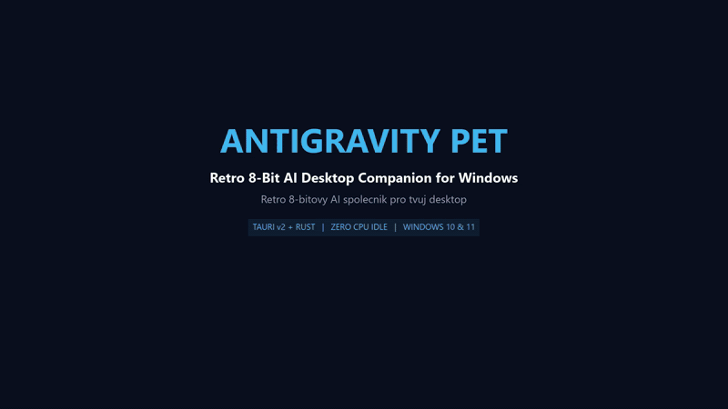

# 🐾 Antigravity Pet (Coucou) — Uživatelská příručka a návod k použití

> **Interaktivní 8-bitový desktopový AI společník (Shimeji) pro Google Antigravity IDE na Windows 10/11.**  
> Zvířátka se procházejí po hlavní liště Windows, reagují na kódování v reálném čase, ožívají vlastními aktivitami a umožňují obousměrnou komunikaci s vaším Antigravity agentem.

  

  <a href="./videa/AntigravityPet_GitHub_Showcase.mp4">
    🎬 <b>Přehrát video v plné kvalitě s 8-bitovými zvuky a hudbou (MP4)</b>
  </a>

---

## 🌟 Hlavní funkce v kostce
- **8 unikátních pixel-art zvířátek** s plynulými retro animacemi (chůze, přemýšlení 🤔, psaní na notebooku 💻, oslava 🎉).
- **Multi-Pet Engine (1 okno = 1 zvířátko):** Otevřete-li v Antigravity IDE další okno nebo projekt, **na liště se automaticky objeví nový parťák** s jiným zvířecím druhem! Původní zvířátko se nikdy nemění ani nenahrazuje.
- **Bezpečnostní pojistka (nikdy 0 zvířátek):** Na ploše vám **nikdy nezmizí všechna zvířátka**. Pokud zavřete okno IDE a na ploše je jediné zvířátko, zůstane jako volný společník a při otevření dalšího okna se k němu automaticky přiřadí.
- **Výjimka pro Nastavení (Settings):** Otevření okna Nastavení (v IDE, v záložce nebo v nastavení Coucou) **nikdy nevytvoří falešné zvířátko „setting“** a nikdy neodstraní vaše stávající zvířátko.
- **Čisté štítky projektů:** Pod zvířátkem se zobrazuje skutečný název projektu/složky (např. `📁 coucou-main`), otevřené soubory (`README.md`, `scraper.py`) jsou inteligentně odfiltrovány.
- **Obousměrné zrcadlo (Chat Overlay) & Tichý režim (Ghost Mode):** Zrcadlí celou historii chatu z IDE v reálném čase a umožňuje posílat prompty přímo z plochy na pozadí, aniž by se okno IDE muselo otevírat nebo kradlo focus z prohlížeče.
- **Bohatý autonomní život s prodlouženými animacemi (6–8,5 s):** Zvířátka v klidu tancují na retro 8-bitový beat 🎧, pískají si do kroku 🎶, dávají si kávu ☕, šlofíka 💤, svačinku 🍴, rozcvičku 🧘, loví brouky 🐛 nebo kýchají 🤧.
- **0 % CPU v klidu & ~25 MB RAM:** Extrémně lehká desktopová aplikace postavená na Tauri v2 a Rustu.
- **Průhledné klikací plátno:** Můžete klikat na zvířátka, přetahovat je myší a otevírat chat – všechno ostatní na obrazovce zůstává plně průchozí (`click-through`).

---

## 🐾 Přehled všech 8 zvířátek

| Zvířátko | Název | Osobnost & Specializace | Zvláštnost v animaci |
| :---: | :--- | :--- | :--- |
| 🐼 | **Panda** | Zenový mistr programování. Zachovává klid i při padající produkci. | V klidu chroustá zelené bambusové stéblo. |
| 🐧 | **Tučňák** | Linuxový Tux. Odborník na terminál a nízkoúrovňové systémové procesy. | Roztomilá kolébavá chůze a ploutvičky. |
| 🐱 | **Kočička** | Zrzavá Neko číča. Zvídavá parťačka pro každodenní psaní kódu. | Špičatá ouška a předení při zelených testech. |
| 🐘 | **Sloník** | Moudrý slon s dlouhou pamětí. Nezapomene na žádný rest v projektu. | Zvedá chobot a radostně troubí při dokončení úkolu. |
| 🦊 | **Lištička** | Bystrá liška s huňatým ocasem. Vidí bugy dřív než kompilátor. | Vlnící se huňatý ocásek s bílou špičkou. |
| 🐵 | **Opička** | Hyperaktivní hacker klávesnice. Rychlé prsty a hravost. | Zběsile ťuká do klávesnice a skáče radostí. |
| 🐶 | **Pejsek** | Věrný Shiba Inu. Nejoddanější přítel každého vývojáře. | Nadšeně vrtí ocáskem a má růžová líčka. |
| 🐯 | **Tygřík** | Odvážný a energický tygr. Rád se pouští do nejtěžších refaktoringů. | Černé pruhy a energické poskakování. |

> 💡 **Tip pro ruční změnu zvířátka (náhodně):** Zvířátko můžete kdykoliv změnit za jiné:
> 1. Stiskem klávesy **`R`** nebo **`Mezerníku`** na klávesnici.
> 2. Kliknutím **kolečkem myši** (Middle click) přímo na tělo zvířátka.
> 3. Kliknutím na tlačítko kostky **`🎲`** nebo na **avatar** v záhlaví chatu.

---

## 🎮 Ovládání myší

| Akce myší | Co se stane |
| :--- | :--- |
| **Levé tlačítko + tažení** | **Přetahování (Drag & Drop):** Zvířátko můžete chytit a vytáhnout ho kamkoliv na monitor. Když ho pustíte, gravitace ho s lehkým zhoupnutím snese zpět na lištu. |
| **Kolečko myši (Middle click)** | **Náhodná změna zvířátka (🎲):** Ihned změní zvířátko za jiného tvora s radostným efektem jisker a bublinou! |
| **Pravé tlačítko (nebo klávesa `C`)** | **Otevření / zavření chatu zrcadla:** Vysune elegantní průhledné okno chatu přímo nad daným zvířátkem. |
| **Dvojklik (Double Click)** | **Otevřít / zaměřit Antigravity IDE:** Zvířátko radostně poskočí s hvězdičkami (`🎯 ✨`) a okamžitě přenese okno vašeho Antigravity IDE do popředí. |
| **Najetí myší (Hover)** | **Pozdrav:** Zvířátko vás mile pozdraví zvukovým tónem, poskočí a zamává tlapkou. |
| **Kliknutí mimo okno chatu** | Okno chatu se automaticky čistě zavře, aniž by překáželo na obrazovce. |

---

## 🎭 Autonomní život zvířátek (Prodloužené a bohaté animace)

Zvířátka na ploše jen pasivně nečekají ani jen nechodí sem a tam. Když je agent v klidu, zvířátko **zcela automaticky a spontánně** provádí různé roztomilé činnosti, které nyní trvají dostatečně dlouho (6 až 8,5 s), abyste si je stihli vychutnat:

1. 🎧 **Hudební vibe & taneček (~8,2 s):** Nasadí si tyrkysová sluchátka, hází tlapkami do rytmu a létají kolem něj hudební noty `🎵 🎶 ✨ 🔥 🕺 ⭐`. Hraje plný **8-taktový retro 8-bitový lofi beat** syntetizovaný přes Web Audio API.
2. 🎶 **Pískání na liště (~6,0 s):** Zvířátko se volně prochází a píská si **dvoudílnou veselou melodii** s realistickým vibratem a jiskřičkami not.
3. ☕ **Kávová pauza (~7,8 s):** Sedne si s kouřícím hrnkem kávy, dá si dva doušky s kresleným zvukem srknutí, stoupá pára (`☕ 💨 ✨`) a podělí se o programátorskou myšlenku (*„☕ Káva = tekutá syntaxe...“*).
4. 💤 **Krátký šlofík / Power Nap (~8,2 s):** Zavře očička, zachumlá se a postupně nad ním stoupá 5 obláčků `💤` (*„💤 Zzz... Ladím sny v pozadí...“*). Po zazvonění tónu se s zívnutím probudí (`🥱`).
5. 🧘 **Rozcvička a zdraví zad (~7,5 s):** Zvířátko se protáhne, udělá dřep a připomene vám zdravé návyky (*„🧘 Nezapomeň se narovnat a protáhnout záda!“* nebo *„👀 Podívej se do dálky z okna, ať si odpočinou oči!“*).
6. 🍴 **Svačinka (~7,8 s):** Dvakrát si křupavě ukousne svého oblíbeného jídla se zvukovým doprovodem (Panda bambus 🎍, Kočička a Tučňák rybičku 🐟, Pejsek kostičku 🦴, Opička banán 🍌, Tygřík steak 🥩, Lištička jahody 🍓, Sloník jablko 🍎).
7. 🐛 **Lov brouků (~7,0 s):** Zvířátko zpozoruje na liště brouka `🐛`, napínavě se připlíží, skočí a zašlápne ho (`💥`) se slovy *„🐛💥 Brouk v kódu vyřešen! Plocha je čistá.“*
8. 🤧 **Kýchnutí (~5,5 s):** Nejprve lechtání v nose, pak skok a pořádné kýchnutí (*„🤧 A-PČÍK! Omlouvám se, asi je v kódu moc prachu!“*).
9. 🚶 **Procházka (~5 až 9 s):** Přirozená a delší procházka podél dolní lišty Windows.

*(Všechny aktivity probíhají plně automaticky s klidným intervalem 28–60 s. Jakmile agent začne pracovat nebo na zvířátko kliknete, okamžitě ztichne veškerá hudba a zvířátko se ihned pustí do kódování na notebooku).*

---

## ⌨️ Klávesové zkratky

Když jste na ploše nebo máte aktivní plátno:

| Klávesa | Funkce |
| :---: | :--- |
| **`R`** nebo **`Mezerník`** | **Náhodně změnit zvířátko (🎲):** Vybere náhodné zvířátko z dostupných druhů a ihned ho promění. |
| **`C`** | **Přepnout chat:** Otevře nebo zavře obousměrné zrcadlo chatu. |
| **`H`** | **Režim soustředění (Focus Mode):** Sbalí zvířátko do nenápadného 4px svítícího bodu sedícího přímo na dolní hraně lišty. Opětovným stiskem `H` nebo kliknutím na tečku se zvířátko vrátí. |
| **`Esc`** | **Zavřít chat / diagnostiku:** Okamžitě zavře otevřené okno chatu nebo diagnostický panel. |
| **`1`** | *(Testovací)* Nastaví stav na **Klid (`idle`)**. |
| **`2`** | *(Testovací)* Nastaví stav na **Přemýšlení (`thinking`)** 🤔. |
| **`3`** | *(Testovací)* Nastaví stav na **Kódování (`working`)** 💻. |
| **`4`** | *(Testovací)* Nastaví stav na **Hotovo (`finish`)** 🎉. |
| **`5`** | *(Testovací)* Nastaví stav na **Chyba (`error`)** ⚠️. |
| **`6`** | *(Testovací)* Rozloučení a animovaný odchod zvířátka. |

---

## 💬 Obousměrné chatové zrcadlo & Tichý režim (Ghost Mode)

Okno chatu je přímým a kompletním mostem mezi vaší plochou a agentem v Antigravity IDE:

### 1. Prvky v hlavičce chatu
- **Avatar zvířátka & Jméno:** Ukazuje, který tvor je k tomuto chatu přiřazen (např. *„🐼 Panda · IDE Mirror“*).
- **Stavový indikátor:** Barevná pulzující tečka informuje o aktuálním stavu agenta:
  - 💤 **Připraven** – agent čeká na váš pokyn.
  - 💭 **Přemýšlím...** – agent analyzuje kód nebo plánuje kroky.
  - 💻 **Kóduji...** – agent spouští nástroje, edituje soubory nebo spouští příkazy.
  - ✨ **Dokončeno** – úkol byl úspěšně hotov.
  - ⚠️ **Čeká na schválení** – agent čeká na povolení příkazu v IDE.
- **Tlačítko `🎲` (Náhodně změnit zvířátko):** Okamžitě vylosuje jiného zvířecího společníka (lze též kliknout přímo na avatar vlevo).
- **Tlačítko `⚙️` (Nastavení zvířátka):** Otevře přímo v okně chatu panel nastavení:
  - 🔊 **Zvuky & Melodie:** Jednoduchý přepínač pro zapnutí/vypnutí všech zvukových efektů a hudby.
  - ⏱️ **Interval mezi animacemi:** Tři rychlé předvolby: **Často (15–30 s)**, **Normálně (30–60 s)**, **Zřídka (60–120 s)**.
  - 🎭 **Povolené Animace (9):** Samostatný přepínač pro každou činnost (Chůze 🚶, Pískání 🎵, Tanec 🎧, Káva ☕, Šlofík 💤, Rozcvička 🧘, Svačinka 🍴, Lov brouka 🐛, Kýchání 🤧) s tlačítky *Vybrat vše* / *Zrušit vše*.
  - 💬 **Vzhled na ploše:** Možnost skrýt/zobrazit textové komiksové bubliny a jmenovku projektu pod nohama (`[📁 coucou-main]`).
  - 🎮 **Vyzkoušet animaci:** Tlačítko *▶️ Spustit náhodnou animaci ihned* pro okamžité otestování povolených animací.
  - 🔄 **Reset:** Jedním klikem vrátí veškeré předvolby do výchozího stavu. Vše se automaticky ukládá do paměti (`localStorage`).
- **Tlačítko `📊` (Diagnostický report):** Otevře integrovaný panel s technickými detaily (HWND okna, PID, stav Named Pipe, historie promptů a hooků).
- **Tlačítko `✕` (Zavřít):** Bezpečně zavře okno chatu (stejně jako klávesa `Esc`).

### 2. Kompletní zrcadlení celé konverzace v reálném čase
- **Živá historie konverzace:** Chat u zvířátka načítá a zobrazuje **kompletní historii chatu z vašeho Antigravity IDE** (`transcript.jsonl`), bez myšlenek agenta či systémových značek.
- **Plnohodnotný Markdown & Bloky kódu:**
  - Krásně naformátované nadpisy, odrážkové a číslované seznamy i citace.
  - Bloky kódu v přehledných kartách s názvem jazyka a tlačítkem **`📋 Kopírovat`** pro okamžité vložení do schránky.
- **Inteligentní rolování & Indikátor `⬇️ Nová zpráva`:**
  - Při otevření a příchodu nových odpovědí chat automaticky hladce roluje na konec k nejnovější zprávě.
  - Pokud rolujete nahoru a čtete starší historii, chat vás **nikdy nestrhne dolů**! Místo toho se dole objeví plovoucí tlačítko `⬇️ Nová zpráva` pro okamžitý návrat.
- **Postupné načítání starší historie:** Bleskově načte posledních 30 zpráv. Pro starší zprávy je nahoře tlačítko `⬆️ Načíst starší historii`.
- **Automatická synchronizace:** Chat na pozadí sleduje změny transcriptu každých 1,2 s. V zavřeném stavu je sledování vypnuto (0,0 % CPU).

### 3. Odesílání promptů na pozadí & Spolehlivé zaměření chatu přes Windows UI Automation (v0.1.2)
- Do spodního pole napište zprávu a stiskněte **`Enter`** (nebo klikněte na tlačítko **`➤`**).
- **100% Spolehlivé vložení bez úniku do terminálu (v0.1.2):**
  - Starší verze mohly při aktivním terminálu v IDE omylem napsat text do PowerShellu. Od verze **v0.1.2** aplikace využívá nativní **Windows UI Automation (`IUIAutomation`)**, které nalezne přesný ovládací prvek chatu (`ControlType::ComboBox`, `Name = "Message input"`).
  - Volání `SetFocus()` přímo přenese klávesový fokus z integrovaného terminálu nebo editoru rovnou do chatu agenta.
  - Text promptu se **nikdy nenapíše do terminálu ani do kódu**, i když jste před kliknutím na zvířátko pracovali v terminálu či jiné aplikaci!
  - Využívá přesné fyzické souřadnice ovládacího prvku nezávisle na rozlišení či DPI monitoru (FullHD, 2K, 4K).
- Můžete psát agentovi čistě přes zvířátko, zatímco jste třeba na webu v Google Chrome – okno IDE vás nemusí vyrušit v popředí.
- Zvířátko začne ihned pilně kódovat na notebooku 💻.

---

## 👥 Multi-Pet Engine (1 okno = 1 zvířátko)

1. **Více oken najednou (2 okna = 2 zvířátka, 3 okna = 3 zvířátka):**
   - Jakmile otevřete nové okno Antigravity IDE, Coucou ho ihned detekuje.
   - Původní zvířátko se **NIKDY nenahrazuje ani nemění za jiné**!
   - Vedle něj na hlavní liště se narodí **nové samostatné zvířátko** s jiným druhem (Panda, Tučňák, Pejsek, Tygřík atd.) a rozestoupí se tak, aby se nepřekrývala.
2. **Přehledné štítky a rozpoznání oken:**
   - **Jmenovka pod zvířátkem (`🏷️`):** Ukazuje název projektu (např. `[● 🐼 Panda · 📁 coucou-main]`).
   - **Tooltip při najetí myší (Hover):** Ukáže spárovaný projekt a nápovědu.
   - **Dvojklik na zvířátko:** Radostně poskočí (`🎯 ✨`), potvrdí okno (*„🎯 Okno: coucou-main“*) a okamžitě ho zaměří.
   - **Záhlaví chatu:** Uvádí přesný název spárovaného projektu.
3. **Zavření okna IDE & Bezpečnostní pojistka:**
   - Když jedno z několika oken zavřete, jeho zvířátko se rozloučí a odejde.
   - **Pokud zavřete poslední okno, poslední zvířátko NIKDY nezmizí.** Zůstává na ploše jako volný společník a čeká na další otevření projektu.
4. **Výjimka pro Nastavení:**
   - Otevření okna Nastavení (v IDE, záložce nebo v Coucou) **nikdy nevytvoří zvířátko „setting“** a nikdy neodstraní vašeho stávajícího parťáka.

---

## 📊 Diagnostika a řešení potíží

1. Otevřete chat (`C` nebo pravý klik).
2. Vpravo nahoře klikněte na ikonku **`📊`**.
3. Zobrazí se panel s HWND okna, PID, stavem Named Pipe a živým proudem událostí, s možností jedním klikem zkopírovat report do schránky.

---

## 🚀 Snadná instalace pro každého (i neprogramátory)

Nemusíte nic programovat ani spouštět přes terminál:
1. Přejděte na stránku **[Vydání na GitHubu (Releases)](https://github.com/kubkic-code/antigravity-pet/releases)**.
2. Stáhněte si hotový instalační program **`AntigravityPet-Setup.exe`**.
3. Spusťte stažený soubor a klikněte na **Instalovat** (nevyžaduje administrátorská práva, instaluje se čistě do profilu uživatele).
4. *(Pokud Windows SmartScreen zobrazí modré upozornění o nepodepsaném souboru, klikněte na **Více informací → Spustit přesto**).*
5. Spusťte aplikaci Antigravity Pet z nabídky Start nebo plochy — zvířátko se okamžitě objeví na spodní liště!

---

## 💖 Poděkování a autorství (Credits)

Tento projekt vznikl díky skvělé práci původního autora:
- **Původní autor a tvůrce:** **Louis Raillé** ([GitHub @louisraille](https://github.com/louisraille))
- **Původní projekt:** Coucou / NotchBuddy (roztomilý desktopový společník)
- **Poděkování:** Obrovské díky Louisovi za jeho úžasnou práci, kreativní vizi a skvěle navrženou základní architekturu aplikace, na které jsme mohli postavit tuto verzi pro Windows a integraci s Google Antigravity IDE.

Windows Port & Antigravity IDE Enhancements:
- Multi-Pet Engine pro více oken současně (1 okno = 1 unikátní zvířátko).
- Pojistka proti ztrátě zvířátka na ploše a výjimka pro okna Nastavení.
- Obousměrný chat mirror a tichá injekce promptů do Antigravity IDE na pozadí (Ghost Mode).
- Automatická detekce událostí agenta (kódování, přemýšlení, otázky `ask_question`, dokončení).
- 8 plně animovaných retro pixel-art zvířátek, prodloužené autonomní animace a 4px režim soustředění na liště.
